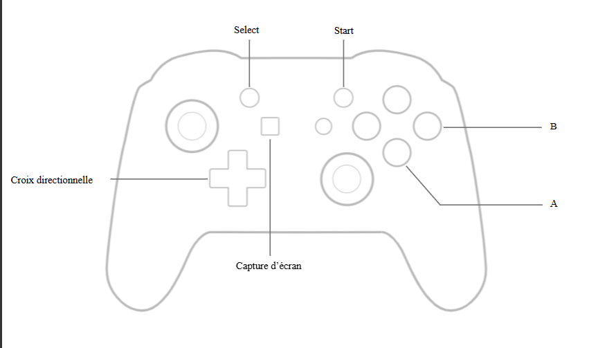

    

Cet émulateur est compatible uniquement avec les ROMs utilisant les types MBC1 et MBC5. 
Les jeux que j'ai testés (Pokemon Jaune, Mario, Tetris, Lucky Luke) fonctionnent parfaitement, mais il reste encore pas mal de bogues au niveau de l'émulation. 
L'émulateur est conçu pour être utilisé avec une manette. Je l'ai testé avec une manette Nintendo Switch Pro. 
La suite serait de faire un émulateur GBA ou SNES. 

